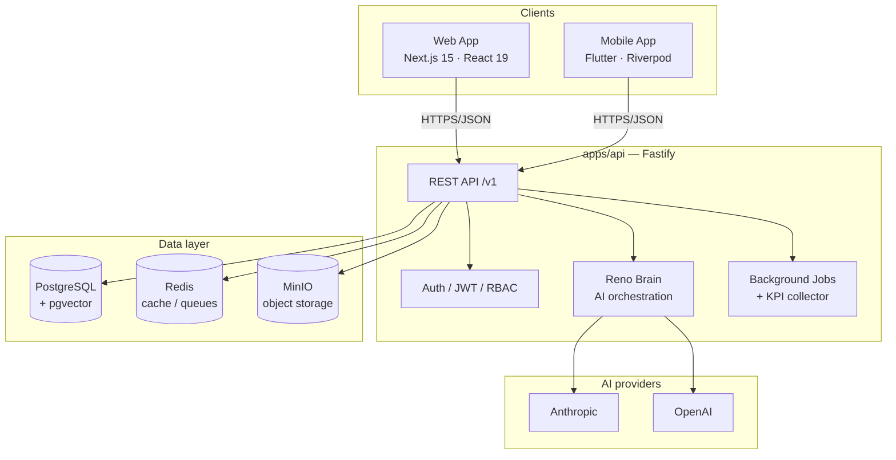

# Reno System


**AI-first Business Operating System** — a multi-tenant platform unifying HR, CRM, Sales, Finance, Inventory, Procurement, Manufacturing, Projects, and an AI executive layer (Reno Brain) behind one API, one web app, and one mobile app.

> Private/proprietary project. Source is visible for review purposes; see [License](#license).

---

## Architecture



---

## What's inside

Reno is a pnpm/Turborepo monorepo with three client surfaces sharing one backend and one database schema:

| App | Stack | Purpose |
|---|---|---|
| `apps/api` | Fastify, Prisma, PostgreSQL (pgvector) | REST API, auth, AI orchestration, background jobs |
| `apps/web` | Next.js 15, React 19, Radix UI, TanStack Query | Full admin/back-office console |
| `apps/mobile` | Flutter, Riverpod, go_router | Employee self-service companion app |

The web sidebar and the mobile drawer are structurally the same taxonomy — **Core, Identity, Business, Workspace, Intelligence, Platform, System** — so a feature added on one side has a clear home on the other.

### Business modules
HR · Projects · CRM · Sales · Finance · Inventory · Procurement · Manufacturing · Analytics

### Platform / AI layer ("Reno Brain")
Automation, Knowledge Graph, AI Agents, LLMOps, AI Governance, Fine-Tuning, Explainability, Predictive/Financial/Sales/HR/Legal/Marketing/Operations AI, plus infra tooling (Kubernetes, multi-region, auto-scaling, zero-trust, SOC/SIEM) exposed as real, queryable modules — not just dashboards.

### Platform services
Marketplace, Licensing, Customer Portal, Release management, Docs Hub, Certification, Service Desk, Audit Logs.

---

## Quick start (local development)

Full step-by-step instructions — including Docker service credentials, migrations, seeding, and known issues — are in **[RUNNING_LOCALLY.md](./RUNNING_LOCALLY.md)**. The short version:

```bash
# 1. Start infra (Postgres + pgvector, Redis, MinIO, MailHog, Adminer, Prometheus, Grafana)
docker compose up -d

# 2. Install dependencies
pnpm install

# 3. Migrate + seed demo data
pnpm db:migrate
pnpm db:seed

# 4. Run API + Web together
pnpm dev
```

- API: `http://localhost:4000` (health check at `/health`)
- Web: `http://localhost:3000`
- Demo login: `admin@demo.com` / `Demo@123456`, workspace `demo`

### Mobile app (optional)

```bash
cd apps/mobile
flutter pub get
flutter run
```

Connects to the API at `http://10.0.2.2:4000` (Android emulator) or your machine's LAN IP (physical device).

---

## Requirements

| Tool | Version |
|---|---|
| Node.js | ≥ 20 |
| pnpm | ≥ 9 |
| Docker Desktop | latest |
| Flutter (optional, for mobile) | 3.x |

---

## Repo layout

```
apps/
  api/        Fastify REST API
  web/        Next.js admin console
  mobile/     Flutter employee app
  uploads/    File-serving service
packages/
  database/   Prisma schema + client + seed
  core/       Shared types, response helpers, error codes
  auth/       Shared auth utilities
  events/     Event bus contracts
  logger/     Shared logging
  plugin-sdk/ Marketplace plugin contract
  sdk/        Public API client SDK
  cli/        Reno CLI
  testing/    Shared test utilities
infra/        Docker, Kubernetes, Helm, Prometheus, Grafana configs
docs/         Additional documentation
```

---

## Scripts

Run from the repo root (Turborepo fans out to the relevant workspace):

```bash
pnpm dev            # API + Web in parallel
pnpm dev:api        # API only
pnpm dev:web        # Web only
pnpm build          # Build all apps
pnpm typecheck      # Typecheck all workspaces
pnpm test           # Run all tests
pnpm db:migrate     # Apply Prisma migrations
pnpm db:seed        # Seed demo tenant + data
pnpm db:studio      # Open Prisma Studio
```

---

## License

`UNLICENSED` — proprietary. All rights reserved. This repository is shared for review/demonstration purposes and is not licensed for reuse, redistribution, or derivative works without permission.
